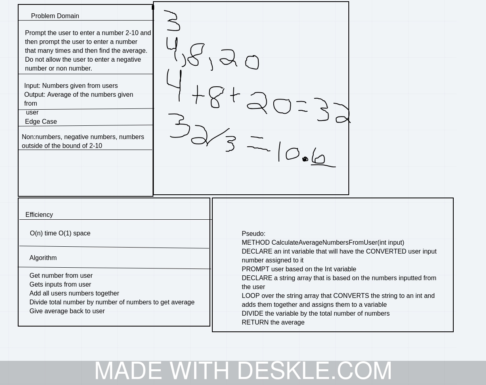

# Console Application System IO

## System IO

Lab03-Unit-Testing

*Author: Bryant Davis*

----

## Description

9 Code Challenges that are new and old concepts that need to be tested.

---

### Getting Started
Clone this repository to your local machine.

```
$ git clone [https://github.com/BryantDavis1986/Lab02-UnitTesting.git]
```

### To run the program from Visual Studio:
Select ```File``` -> ```Open``` -> ```Project/Solution```

Next navigate to the location you cloned the Repository.

Double click on the ```Lab02-Unit-Testing``` directory.

Then select and open ```Lab02-Unit-Testing.sln```

---

### Visuals
***[Add screenshots of your application in action]***

#### Whiteboard



---

### Change Log
***[The change log will list any changes made to the code base. This includes any changes from TA/Instructor feedback]***
2.0: *All Challenges and tests complete and passing* - July 18 2020
1.9: *Challenge 9 incomplete* - 8 July 2020  
1.7: *Challenge 7* - 8 July 2020  
1.6: *Challenge 6* - 8 July 2020  
1.5: *Challenge 5* - 8 July 2020  
1.4: *Challenge 4* - 8 July 2020  
1.3: *Challenge 3* - 8 July 2020  
1.2: *Challenge 2* - 8 July 2020  
1.1: *Challenge 1* - 8 July 2020  


------------------------------
For more information on Markdown: https://www.markdownguide.org/cheat-sheet
